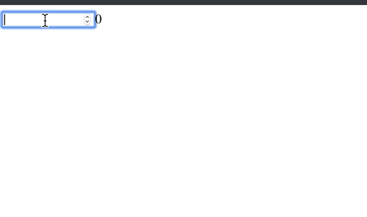

# Установка

> npm install --save light-state-manager

или

> yarn add light-state-manager

# Использование

Данная библиотека позволяет создавать отдельные модули, в которых можно создавать `action` функции.

Создадим модуль "Счетчик".

```typescript jsx
import { StoreContext } from "light-state-manager";

export interface StateInterface {
  counter: number;
}

const initialState: StateInterface = {
  counter: 0,
};
export default new StoreContext(
  initialState, {
    setCounter
  }
});
```

В поле `actions` мы указами `setCounter` для установки значений в нашем модуле. Создавать каждый `action` можно с помощью конструкции `new Action<StateInterface>().create` где `StateInterface` интерфейс стейта нашего модуля.

```typescript jsx
import { Action } from "light-state-manager";

import { StateInterface } from "./index";

export const setCounter = new Action<StateInterface>().create(
  {
    setCounter: (_, payload: number) => {
      return { counter: payload };
    },
  },
  (actions, count: number) => {
    setTimeout(() => actions.setCounter(count), 1000);
  },
);
```

Вторым параметром функции `create` является функция, внутри которой мы имеем доступ к параметру `actions`. С помощью этого параметра мы можем вызвать отдельные обработчики событий определенным первым параметром. Каждый обработчик должен возвращать новый стейт.

Теперь когда мы определили стейт подключим его.

```typescript jsx
import React from "react";
import ReactDOM from "react-dom";
import { StoreContext } from "light-state-manager";

import App from "./App";

import userModule from "state/user";

const WrappedApp = StoreContext.connectContexts([userModule], App);

ReactDOM.render(<WrappedApp />, document.getElementById("root"));
```

`StoreContext.connectContexts` позволяет оборачивать наше приложение для проброса в него необходимых данных.

Функция `pureConnect` позволяет вызывать перерисовку компонента только когда изменились зависимые пропсы.

```typescript jsx
import React from "react";
import { pureConnect } from "light-state-manager";

import userModule from "state/user";

const App: React.FC = ({ counter, setCounter }) => {
  return (
    <>
      <input type="number" onChange={e => setCounter(Number(e.target.value))} />
      <span>{counter}</span>
    </>
  );
};

export default pureConnect(App, () => {
  const { counter, setCounter } = userModule.getState();
  return {
    counter,
    setCounter,
  };
});
```

И наконец подключаем его к компоненту. Готово!


